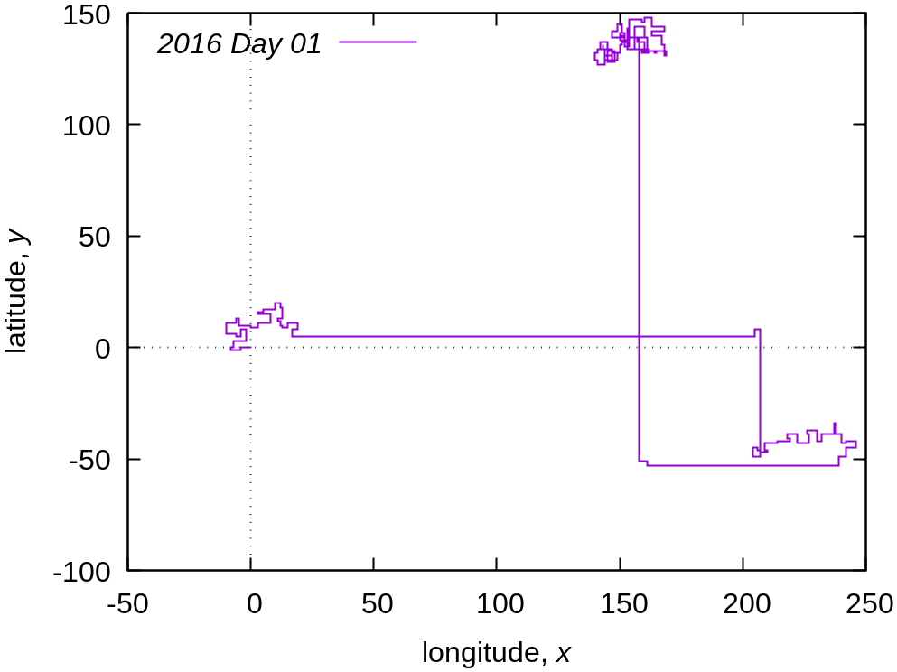
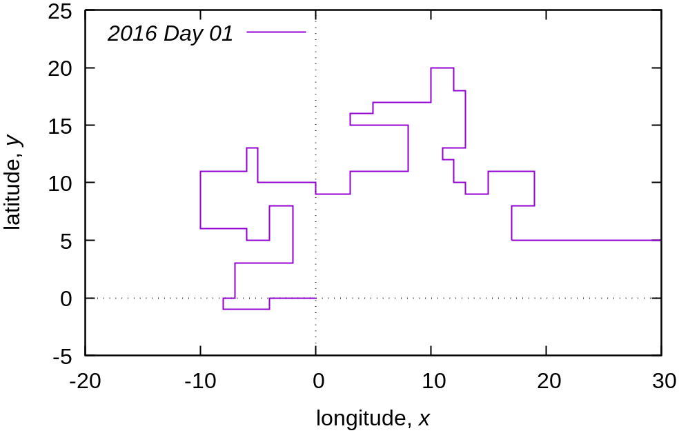
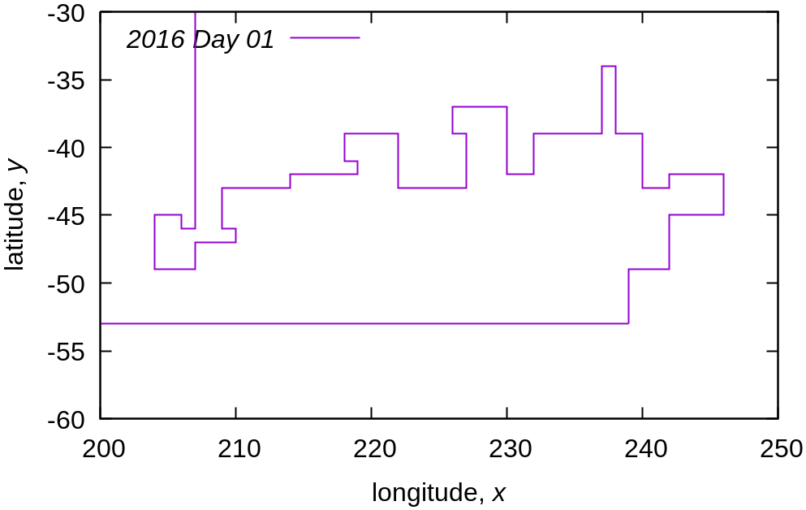

I couldn't get a proper return from the clojure function for part two, so I "gave up," put my numerical physics hat on, and plotted it.

```bash
$ clj plot.clj > stops.dat
$ gnuplot stops.gnuplot
```





