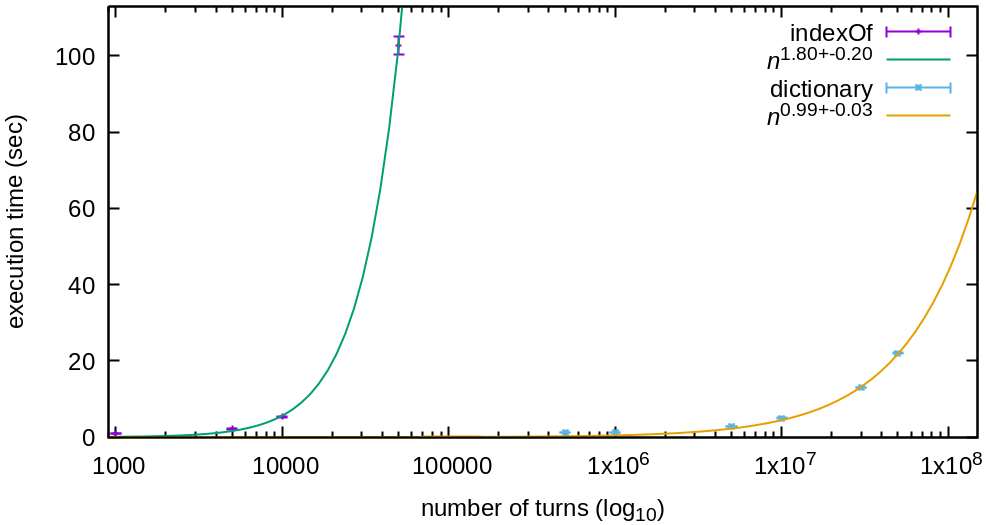

## performance tests

My algorithm in [part one](one.clj) retains a vector of all of the past values, which then gets searched using `indexOf` at each step in order to find the last time that the value occurred. In the case of new values, it searches the entire `n` entries. This scales almost as bad as O(n^2). It would take about 3 months to execute n=30000000.

Once I saw the requirements for part two, I [refactored in order to use a dictionary](two.clj) of each value, retaining only its most recent occurrence. This allowed for hashed lookup in the dictionary, which I think is O(log32n), and so the O(n) of looping through the problem size dominates.

